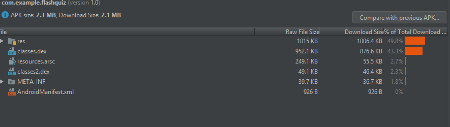

# FlashQuiz 

## Team Members:
Elizabeth Billings - Edit_Flashcard  
PranavSatwik Vella - Statistics  
Romal Patel - Flashcard_Back  
Simi Maithani - MainActivity and Flashcard_Front  

## Introduction
FlashQuiz is a flashcard app to help students study. Users can create a deck of flashcards and then quiz themselves and view statistics on how well they've done.

## Supported Devices
The app should work for all android devices with the android versions above android 5.0 (lollipop).

## APK 

## Installation
Download the app as a zip, then unzip it and load it using AndroidStudio. Run the app from there. 

## Other
There are no credentials needed to use the app, and the app didn't require any outside sources. 
